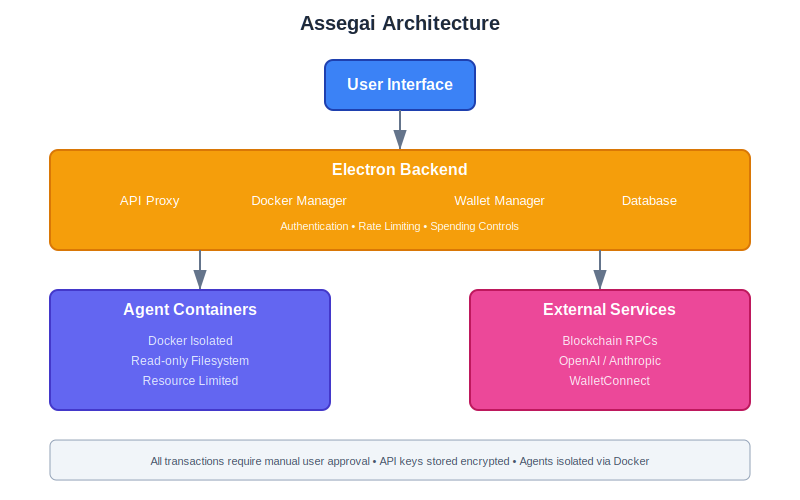

Assegai AI Sandbox is a cross-platform desktop application that enables developers to run AI agents in secure, isolated Docker environments with controlled blockchain transaction capabilities.

## What is Assegai?

Assegai provides a sandboxed environment where AI agents can:

- **Interact with blockchain networks** via whitelisted RPC endpoints
- **Request transaction approvals** with user oversight
- **Call AI APIs** (OpenAI, Anthropic) for intelligent decision-making
- **Operate within strict resource limits** to prevent system compromise
- **Log activity** visible in real-time through the UI

All agent operations are containerized, rate-limited, and subject to spending controls, ensuring that even malicious or buggy agents cannot compromise the host system or wallet.

## Core Purpose

The primary goal of Assegai is to enable **safe experimentation with autonomous agents** that can interact with real blockchain networks and AI services, in a unified and convenient application. Traditional approaches to running such agents involve significant security risks and operational overhead. Assegai mitigates these through:

1. **Docker isolation**: Agents run in hardened containers with read-only filesystems
2. **Manual transaction approval**: No autonomous fund transfers—every transaction requires user confirmation
3. **Spending limits**: Per-transaction, daily, weekly, and monthly caps prevent excessive spending
4. **Token allowances**: Granular control over which assets agents can spend
5. **RPC whitelisting**: Agents can only access pre-approved blockchain endpoints
6. **Rate limiting**: API and RPC calls are throttled per agent

## Key Features

### Agent Management

- **Docker-based isolation**: Each agent runs in a separate container with strict security policies
- **Resource limits**: Configurable CPU and memory caps per agent
- **Runtime support**: Currently supports Node.js agents (Python support planned)
- **Lifecycle management**: Install, start, stop, and delete agents through the UI

### Transaction Control

- **User approval workflow**: All transactions require explicit confirmation
- **Spending limits**: Native asset limits enforced across time windows
- **Token allowances**: ERC20 token spending configured per agent
- **Transaction history**: Complete audit trail of all agent requests

### Wallet Integration

- **WalletConnect support**: Connect any compatible mobile or browser wallet
- **Local test accounts**: Use hardcoded keys for development against local testnets
- **Multi-chain support**: Works with any EVM-compatible blockchain

### Developer Experience

- **Simple SDK**: Lightweight JavaScript SDK for agent development
- **Manifest-based configuration**: Declarative agent permissions and requirements
- **Real-time logging**: Agent logs visible in the UI
- **Example agents**: Reference implementations to get started quickly

## Architecture

Assegai uses a simple four-layer architecture:

**User Interface** - Vue 3 frontend for managing agents and approving transactions

**Electron Backend** - Core services including the API proxy (port 8765), Docker manager, wallet manager, and database. Handles authentication, rate limiting, and spending controls.

**Agent Containers** - Docker-isolated environments where agents run with read-only filesystems and strict resource limits

**External Services** - Blockchain RPCs, AI APIs (OpenAI/Anthropic), and WalletConnect for transaction signing

All agent requests flow through the backend, which enforces security policies before proxying to external services. Every transaction requires manual user approval in the UI.

## Use Cases

### Autonomous Trading Bots

Build agents that monitor DeFi protocols and execute trades based on market conditions, with transaction approvals ensuring you review every trade before execution.

### Multi-Chain Monitoring

Create agents that watch multiple blockchains for specific events (token transfers, contract deployments, etc.) and log or react to them.

### AI-Powered Analytics

Develop agents that fetch on-chain data, analyze it using AI APIs, and present insights or recommendations through logs.

### Automated Operations

Build agents that perform routine blockchain tasks (claiming rewards, rebalancing portfolios) on a schedule, with your approval for each action.

### Testing and Development

Use Assegai to test agent logic against local testnets (Anvil, Hardhat) before deploying to production environments.

## Security Model

Assegai's security is based on **defense in depth**:

- **Layer 1 - Docker Isolation**: Agents cannot access the host filesystem, network, or other containers
- **Layer 2 - Resource Limits**: CPU and memory caps prevent DoS attacks
- **Layer 3 - Spending Controls**: Token allowances and spending limits prevent fund drainage
- **Layer 4 - User Approval**: Manual confirmation required for every transaction
- **Layer 5 - Rate Limiting**: API abuse is prevented through per-agent quotas
- **Layer 6 - RPC Whitelisting**: Agents can only query approved blockchain endpoints

No single layer is sufficient—together they create a robust security posture for running untrusted code.

## Workflow Example

1. **Install an agent**: Select a directory containing an `assegai.json` manifest
2. **Configure permissions**: Set token allowances and spending limits
3. **Start the agent**: Container launches with isolated environment
4. **Agent operates**: Queries blockchain data, calls AI APIs, logs activity
5. **Transaction request**: Agent requests a transaction (e.g., token swap)
6. **User reviews**: Transaction details appear in approval overlay
7. **User approves**: Transaction is signed and broadcast to the network
8. **Agent continues**: Receives transaction hash and proceeds with logic

## Getting Started

To begin using Assegai:

1. [Install Docker](installation#docker-installation) and ensure it's running
2. [Install Assegai](installation) for your platform
3. [Connect your wallet](wallet-auth) via WalletConnect or local test account
4. [Install the example agent](example-agent) to see a working demo
5. Review the [API Proxy Reference](api-proxy-reference) to build your own agents

---

## MVP Status Disclaimer

:::caution[Early Development - MVP Status]

**Assegai AI Sandbox is currently in MVP (Minimum Viable Product) stage.**

This means:

- **Active Development**: Features are still being implemented and refined
- **API Changes**: SDK and configuration formats may change between versions
- **Limited Testing**: The application has not undergone extensive security auditing
- **Documentation Gaps**: Some features may be underdocumented or have incomplete examples
- **Platform Issues**: Edge cases and platform-specific bugs are still being discovered

### Not Recommended For

- **Production use with mainnet funds**: Use testnets or small amounts only
- **Mission-critical operations**: The application may have bugs or unexpected behavior
- **Unattended operation**: Always monitor running agents

### Recommended For

- **Experimentation and learning**: Perfect for exploring AI agent development
- **Testnet development**: Safe environment for building and testing agents
- **Proof-of-concept projects**: Validate ideas before production implementation
- **Educational purposes**: Learn about agent security and blockchain interactions

### We Need Your Help

Assegai is an open-source project that benefits from community contributions. We're actively seeking:

- **Bug reports**: Help us identify and fix issues
- **Feature requests**: Share ideas for improvements
- **Code contributions**: Implement new features or fix bugs
- **Documentation improvements**: Help make the docs clearer and more comprehensive
- **Testing**: Try Assegai on different platforms and configurations
- **Security review**: Identify potential vulnerabilities

**How to Contribute:**

- Report issues on [GitHub Issues](https://github.com/your-org/assegai-sandbox/issues)
- Join discussions in [GitHub Discussions](https://github.com/your-org/assegai-sandbox/discussions)
- Submit pull requests following our [Contributing Guide](contributing)
- Share feedback on your experience using Assegai

Your input directly shapes the future of this project. Whether you're a developer, security researcher, or enthusiast, we welcome your participation.

### Roadmap

Upcoming features and improvements:

- **Python runtime support**: Extend beyond Node.js agents
- **Transaction confirmation tracking**: Monitor on-chain status
- **Enhanced logging UI**: Real-time log streaming in the interface
- **Agent marketplace**: Discover and share pre-built agents
- **Multi-wallet support**: Connect multiple wallets simultaneously
- **API usage dashboard**: Visualize costs and token consumption
- **Advanced security policies**: AppArmor, SELinux, custom seccomp profiles
- **Performance optimizations**: Faster agent startup and reduced memory usage

See the full roadmap and vote on features in [GitHub Projects](https://github.com/your-org/assegai-sandbox/projects).

:::

---

## Next Steps

- **New users**: Start with [Installation](installation) and [Wallet Authentication](wallet-auth)
- **Developers**: Jump to [Example Agent](example-agent) and [API Proxy Reference](api-proxy-reference)
- **Contributors**: Read the [Contributing Guide](contributing) and [Building](building) instructions
